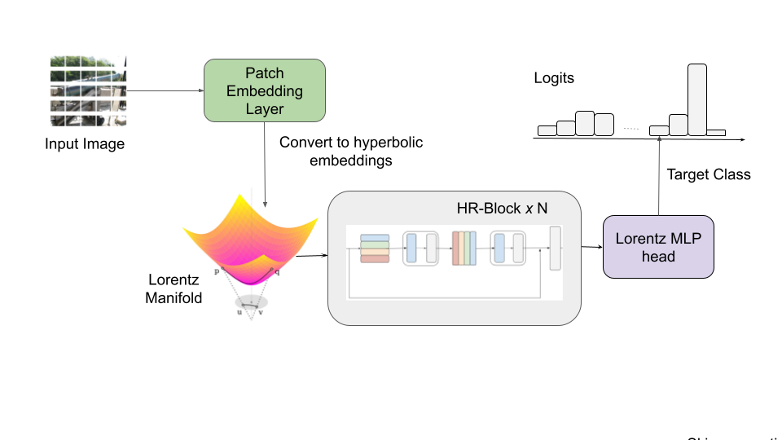

# Efficient Hyperbolic Perceptron for Image Classification
This repository contains the code for the paper "Efficient Hyperbolic Perceptron for Image Classification".




## Setup environment
```
pip install -qr requirements.txt
```
## Set pythonpath
```
# From main dir
export PYTHONPATH="$PWD"
```
## Set WANDB API key

```
export WANDB_API_KEY = $your_key$
```

## Config file
Change hyperparameters in `sample_configs/base_config.yaml`

## Training

```
python3 pipeline.py --conf `path to config file`
```
## Citation
Please consider citing this work using this BibTex entry
```

@Article{electronics12194027,
AUTHOR = {Ahsan, Ahmad Omar and Tang, Susanna and Peng, Wei},
TITLE = {Efficient Hyperbolic Perceptron for Image Classification},
JOURNAL = {Electronics},
VOLUME = {12},
YEAR = {2023},
NUMBER = {19},
ARTICLE-NUMBER = {4027},
URL = {https://www.mdpi.com/2079-9292/12/19/4027},
ISSN = {2079-9292},
ABSTRACT = {Deep neural networks, often equipped with powerful auto-optimization tools, find widespread use in diverse domains like NLP and computer vision. However, traditional neural architectures come with specific inductive biases, designed to reduce parameter search space, cut computational costs, or introduce domain expertise into the network design. In contrast, multilayer perceptrons (MLPs) offer greater freedom and lower inductive bias than convolutional neural networks (CNNs), making them versatile for learning complex patterns. Despite their flexibility, most neural architectures operate in a flat Euclidean space, which may not be optimal for various data types, particularly those with hierarchical correlations. In this paper, we move one step further by introducing the hyperbolic Res-MLP (HR-MLP), an architecture extending the attention-free MLP to a non-Euclidean space. HR-MLP leverages fully hyperbolic layers for feature embeddings and end-to-end image classification. Our novel Lorentz cross-patch and cross-channel layers enable direct hyperbolic operations with fewer parameters, facilitating faster training and superior performance compared to Euclidean counterparts. Experimental results on CIFAR10, CIFAR100, and MiniImageNet confirm HR-MLP's competitive and improved performance.},
DOI = {10.3390/electronics12194027}
}


```


