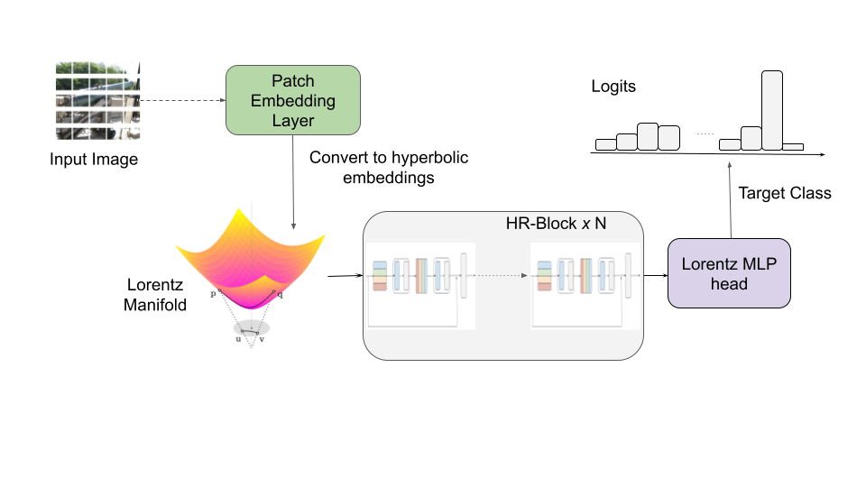

# Efficient Hyperbolic Perceptron for Image Classification
This repository contains the code for the paper "Efficient Hyperbolic Perceptron for Image Classification".




## Setup environment
```
pip install -qr requirements.txt
```
## Set pythonpath
```
# From main dir
export PYTHONPATH="$PWD"
```
## Set WANDB API key

```
export WANDB_API_KEY = $your_key$
```

## Config file
Change hyperparameters in `sample_configs/base_config.yaml`

## Training

```
python3 pipeline.py --conf `path to config file`
```


